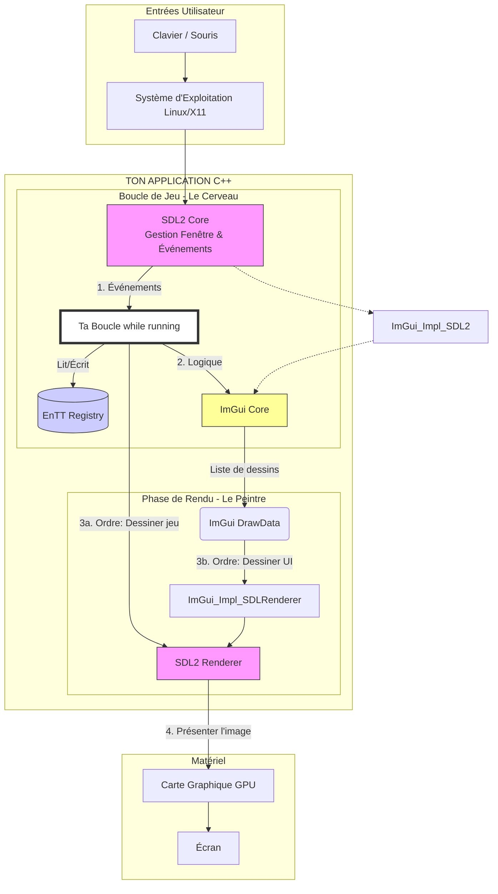

```mermaid
graph TD
    subgraph INPUT [Entrées Utilisateur]
        KBD[Clavier / Souris] --> OS[Système d'Exploitation Linux/X11]
    end

    subgraph APP [TON APPLICATION C++]
        OS --> SDL_CORE[SDL2 Core<br>Gestion Fenêtre & Événements]

        subgraph LOGIC [Boucle de Jeu - Le Cerveau]
            SDL_CORE -- "1. Événements" --> GAME_LOOP[Ta Boucle while running]
            GAME_LOOP -- "Lit/Écrit" --> ENTT[(EnTT Registry)]
            GAME_LOOP -- "2. Logique" --> IMGUI_CORE[ImGui Core]
        end

        subgraph RENDERING [Phase de Rendu - Le Peintre]
            GAME_LOOP -- "3a. Ordre: Dessiner jeu" --> SDL_RENDERER[SDL2 Renderer]
            IMGUI_CORE -- "Liste de dessins" --> IMGUI_DRAW_DATA(ImGui DrawData)
            IMGUI_DRAW_DATA -- "3b. Ordre: Dessiner UI" --> IMGUI_BACKEND_RDR[ImGui_Impl_SDLRenderer]
            IMGUI_BACKEND_RDR --> SDL_RENDERER
        end
    end

    subgraph HARDWARE [Matériel]
        SDL_RENDERER -- "4. Présenter l'image" --> GPU[Carte Graphique GPU]
        GPU --> SCREEN[Écran]
    end

    %% Liaisons
    SDL_CORE -.-> IMGUI_BACKEND_PLAT[ImGui_Impl_SDL2]
    IMGUI_BACKEND_PLAT -.-> IMGUI_CORE

    style SDL_CORE fill:#f9f,stroke:#333
    style SDL_RENDERER fill:#f9f,stroke:#333
    style ENTT fill:#ccf,stroke:#333
    style IMGUI_CORE fill:#ff9,stroke:#333
    style GAME_LOOP fill:#fff,stroke:#333,stroke-width:4px
```